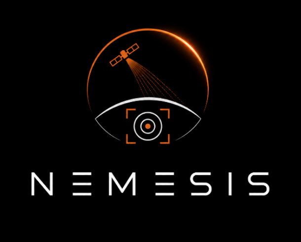

# NEMESIS — Vigilância Orbital contra o Trabalho Escravo

<p align="center">
  
</p>

<p align="center">
  
  
  
  
  
</p>

---

## O que é o NEMESIS

Existem mais de **40 milhões de pessoas** em situação de escravidão moderna no mundo hoje. A maioria está escondida em regiões remotas, longe de fiscais e autoridades. Mas essas operações deixam marcas físicas na terra — fornos de tijolo, garimpos ilegais, acampamentos isolados, embarcações suspeitas — que são **visíveis do espaço**.

O **NEMESIS** usa imagens de satélite (ESA Sentinel-1/2 e NASA Landsat-8) e visão computacional para detectar automaticamente essas estruturas, gerar um **score de risco por região** e alertar autoridades e ONGs. Tudo sem capturar dados de pessoas — o sistema analisa a paisagem, não indivíduos.

> Projeto acadêmico desenvolvido para a **FIAP Global Solution 2026 — Engenharia de Software**.

---

## 👥 Equipe

| Nome                     | RM     |
| ------------------------ | ------ |
| Kaiky Alvaro Miranda     | 98118  |
| Lucas Rodrigues da Silva | 98344  |
| Juan Pinheiro de França  | 552202 |

---

## Sumário

1. [Como o sistema funciona](#como-o-sistema-funciona)
2. [Estrutura do repositório](#estrutura-do-repositório)
3. [Tecnologias utilizadas](#tecnologias-utilizadas)
4. [Infraestrutura na nuvem (Azure)](#infraestrutura-na-nuvem-azure)
5. [Rodando localmente](#rodando-localmente)
6. [Subindo na nuvem (deploy no Azure)](#subindo-na-nuvem-deploy-no-azure)
7. [Pipelines de CI/CD](#pipelines-de-cicd)
8. [Alinhamento com os ODS da ONU](#alinhamento-com-os-ods-da-onu)
9. [Referências](#referências)

---

## Como o sistema funciona

O NEMESIS segue um fluxo de 4 etapas:

```
1. SATÉLITE captura imagem da região (10m por pixel, a cada 6 dias)
        ↓
2. IA analisa a imagem em janelas de 60×60m procurando padrões suspeitos
   → Forno de tijolo?  → Garimpo ilegal?  → Acampamento remoto?  → Embarcação suspeita?
        ↓
3. SCORE DE RISCO é calculado por região, cruzando as detecções com dados
   socioeconômicos (IDH, isolamento geográfico, dados da OIT)
        ↓
4. ALERTA georreferenciado é enviado para ONGs, Ministério do Trabalho e Polícia Federal
```

O dashboard publicado no Azure exibe esse mapa de risco em tempo real para qualquer pessoa com o link.

---

## Estrutura do repositório

```
nemesis/
│
├── src/                        ← Frontend da aplicação (o dashboard)
│   ├── index.html              ← Página principal
│   ├── style.css               ← Estilo visual
│   ├── app.js                  ← Simulador de detecção e animações
│   └── img/
│       ├── logomarca.png
│       └── logo_nemesis.png
│
├── infra/                      ← Infraestrutura como código (Terraform)
│   ├── main.tf                 ← Todos os recursos Azure
│   ├── variables.tf            ← Variáveis configuráveis
│   ├── outputs.tf              ← Valores retornados após o deploy
│   └── providers.tf            ← Configuração do provider Azure
│
├── .github/workflows/
│   ├── ci.yml                  ← CI: valida o código a cada push
│   └── cd.yml                  ← CD: faz o deploy quando o código chega na main
│
├── .gitignore
└── README.md
```

---

## Tecnologias utilizadas

| O que faz | Tecnologia |
| --- | --- |
| Interface do usuário | HTML5, CSS3 e JavaScript puro — sem frameworks |
| Infraestrutura como código | Terraform (cria todos os recursos Azure automaticamente) |
| Nuvem | Microsoft Azure |
| Pipelines de automação | GitHub Actions |
| Imagens de satélite | ESA Sentinel-1/2 · NASA Landsat-8 (gratuitos, acesso público) |
| Fontes | Orbitron e Rajdhani via Google Fonts |

---

## Infraestrutura na nuvem (Azure)

Todos os recursos abaixo são criados **automaticamente** pelo Terraform quando o CD roda. Não é necessário criar nada manualmente no portal Azure.

| Recurso | Nome no Azure | Para que serve |
| --- | --- | --- |
| **Resource Group** | `rg-nemesis` | É o "organizador" — todos os outros recursos ficam dentro dele. Facilita gerenciar, monitorar e deletar tudo de uma vez. |
| **App Service Plan** | `plan-nemesis` | Define o servidor (Linux, plano gratuito F1) onde o site vai rodar. Sem ele, não existe Web App. |
| **Web App** | `nemesis-app` | É o site em si. Fica em `nemesis-app.azurewebsites.net` com HTTPS automático e deploy via pipeline. |
| **Application Insights** | `ai-nemesis` | O sistema de monitoramento. Registra acessos, erros, tempo de resposta — gratuito até 5 GB/mês. |
| **Key Vault** | `kv-nemesis-gs26` | Cofre digital para guardar senhas e chaves de API com segurança. A chave da API do Sentinel fica aqui, nunca no código. |
| **Key Vault Secret** | `sentinel-api-key` | O segredo em si — a chave de acesso às imagens de satélite do Sentinel Hub. |
| **Monitor Action Group** | `ag-nemesis-alerts` | Lista de quem recebe notificação quando um alerta dispara (e-mail da equipe). |
| **Monitor Alert Rule** | `alert-http-5xx` | Alerta automático: se o site tiver mais de 10 erros em 5 minutos, a equipe recebe um e-mail. |
| **Role Assignment** | *(IAM)* | Permissão que o GitHub Actions precisa para fazer deploy no Azure. Sem isso, o pipeline não tem acesso. |

---

## Rodando localmente

Você não precisa do Azure para ver o dashboard funcionando. Basta ter o Node.js instalado.

### Pré-requisito

- [Node.js 18+](https://nodejs.org) — só para usar o servidor local

### Passos

```bash
# 1. Clone o repositório
git clone https://github.com/seu-usuario/nemesis.git
cd nemesis

# 2. Suba um servidor local dentro da pasta src/
npx serve src

# 3. Acesse no navegador
# → http://localhost:3000
```

Pronto. O simulador de detecção, o painel de monitoramento e todas as seções funcionam localmente sem nenhuma conta Azure.

---

## Subindo na nuvem (deploy no Azure)

### Pré-requisitos

- Conta no [Azure](https://azure.microsoft.com/free) (gratuita)
- [Terraform](https://developer.hashicorp.com/terraform/install) instalado
- [Azure CLI](https://learn.microsoft.com/pt-br/cli/azure/install-azure-cli) instalado

---

### Passo 1 — Criar o Service Principal (uma vez só)

O Service Principal é uma "conta de serviço" que o GitHub Actions usa para acessar o Azure no lugar da sua conta pessoal.

```bash
# Faça login no Azure
az login

# Crie o Service Principal e anote os valores que aparecerem
az ad sp create-for-rbac \
  --name "sp-nemesis-github" \
  --role Contributor \
  --scopes /subscriptions/<SEU_SUBSCRIPTION_ID> \
  --sdk-auth
```

O comando vai devolver um JSON com `clientId`, `clientSecret`, `subscriptionId` e `tenantId`. Guarde esses valores — você vai precisar deles nos próximos passos.

---

### Passo 2 — Configurar o terraform.tfvars

Dentro da pasta `infra/`, crie o arquivo `terraform.tfvars` com base no exemplo:

```hcl
# infra/terraform.tfvars  ← NÃO commitar esse arquivo (já está no .gitignore)

project_name        = "nemesis"
location            = "East US"
environment         = "production"
app_service_sku     = "F1"
github_sp_object_id = "OBJECT-ID-DO-SERVICE-PRINCIPAL"
alert_email         = "seu-email@gmail.com"
```

> O `github_sp_object_id` é o `objectId` do Service Principal criado no passo anterior.  
> Para encontrá-lo: `az ad sp show --id <clientId> --query id -o tsv`

---

### Passo 3 — Subir a infraestrutura pelo terminal (primeira vez)

```powershell
# Defina as credenciais do Service Principal no terminal
$env:ARM_SUBSCRIPTION_ID = "<subscriptionId do JSON>"
$env:ARM_CLIENT_ID       = "<clientId do JSON>"
$env:ARM_CLIENT_SECRET   = "<clientSecret do JSON>"
$env:ARM_TENANT_ID       = "<tenantId do JSON>"

# Entre na pasta de infra e aplique o Terraform
cd infra
terraform init     # baixa o provider Azure (só na primeira vez)
terraform plan     # mostra o que vai ser criado (não cria nada ainda)
terraform apply    # cria tudo no Azure — confirme com "yes"
```

Resultado esperado:

```
Plan: 9 to add, 0 to change, 0 to destroy.
Apply complete! Resources: 9 added.

Outputs:
  app_service_url = "https://nemesis-app.azurewebsites.net"
```

---

### Passo 4 — Configurar os Secrets no GitHub

No repositório GitHub, vá em **Settings → Secrets and variables → Actions** e adicione:

| Secret | De onde pegar |
| --- | --- |
| `ARM_SUBSCRIPTION_ID` | JSON do Service Principal |
| `ARM_CLIENT_ID` | JSON do Service Principal |
| `ARM_CLIENT_SECRET` | JSON do Service Principal |
| `ARM_TENANT_ID` | JSON do Service Principal |
| `GITHUB_SP_OBJECT_ID` | `az ad sp show --id <clientId> --query id -o tsv` |
| `ALERT_EMAIL` | Seu e-mail para receber alertas do Azure |

Após o `terraform apply` do passo anterior, adicione também:

| Secret | De onde pegar |
| --- | --- |
| `AZURE_WEBAPP_PUBLISH_PROFILE` | Portal Azure → `nemesis-app` → botão **"Get publish profile"** → copie o conteúdo do arquivo |

---

### Passo 5 — Fazer o primeiro push

```bash
git init
git add .
git commit -m "feat: NEMESIS — Global Solution 2026"
git remote add origin https://github.com/<seu-usuario>/nemesis.git
git push -u origin main
```

O pipeline de CD vai rodar automaticamente e publicar o site.  
Acompanhe em: **GitHub → aba Actions**

---

## Pipelines de CI/CD

O projeto tem duas pipelines automáticas:

### CI — Integração Contínua (`ci.yml`)

**Quando roda:** em todo `git push`, em qualquer branch.  
**O que faz:** verifica se o código está correto antes de chegar na main.

| Etapa | O que verifica |
| --- | --- |
| Validar Terraform | Checa a formatação dos arquivos `.tf` com `terraform fmt` |
| Validar Frontend | Confirma que `index.html`, `style.css` e `app.js` existem |

Se qualquer etapa falhar, o merge para a main fica bloqueado.

---

### CD — Entrega Contínua (`cd.yml`)

**Quando roda:** toda vez que um código chega na branch `main`.  
**O que faz:** sobe a infraestrutura no Azure e publica o site automaticamente.

| Etapa | O que faz |
| --- | --- |
| Deploy Infra | Roda `terraform apply` e garante que os 9 recursos Azure existem |
| Deploy App | Publica a pasta `src/` no Azure App Service |

O segundo job (`Deploy App`) só começa depois que o primeiro (`Deploy Infra`) terminar com sucesso.

---

## Alinhamento com os ODS da ONU

| ODS | Como o NEMESIS contribui |
| --- | --- |
| **8 — Trabalho Decente** | Detecta infraestrutura de trabalho forçado antes que fiscais humanos consigam chegar |
| **10 — Redução das Desigualdades** | Protege as populações mais vulneráveis com monitoramento contínuo e não invasivo |

---

## Referências

- [ESA Copernicus — Sentinel Hub](https://sentinel.esa.int)
- [NASA Earthdata — Landsat](https://earthdata.nasa.gov)
- [OIT — Relatório Global sobre Trabalho Forçado 2024](https://www.ilo.org)
- [Universidade de Nottingham — Detecção de fornos de tijolo com CNN](https://doi.org/10.1098/rspb.2021.2093)
- [Walk Free Foundation — Global Slavery Index 2023](https://www.globalslaveryindex.org)
- [Terraform — Azure Provider](https://registry.terraform.io/providers/hashicorp/azurerm/latest/docs)
